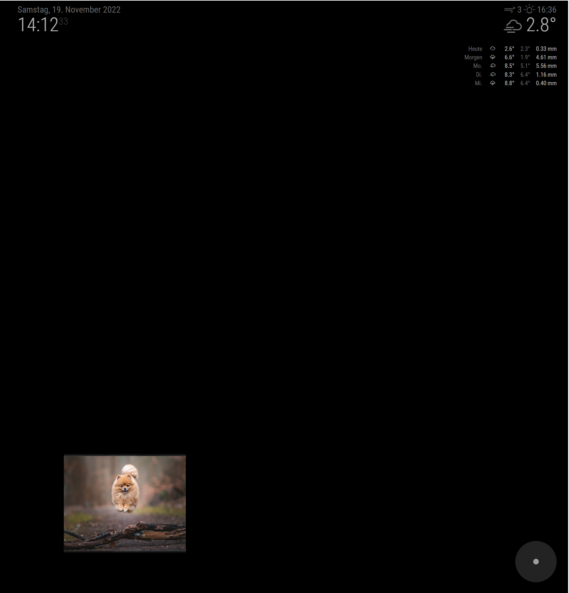

# MMM-piwigo-photo-wheel
This is a module for the [MagicMirror](https://github.com/MichMich/MagicMirror), which displays images downloaded from a [Piwigo](https://piwigo.org) photo library instance.

### Preview


## Getting Started

### Prerequisites

You need to have access to a Piwigo instance that hosts your images. Setup an album and a user that has access rights to the album.

### Install the module

1. Navigate to your `modules` folder
1. Clone this repository
    ````
    git clone https://github.com/nsieg/MMM-piwigo-photo-wheel.git
    ````
1. Install dependencies
    ````
    npm install
    ````

### Configure the module

Add `MMM-piwigo-photo-wheel` to the `modules` array in `config.js`. Adjust URL, username and password to your instance. Make sure that the URL points to the Piwigo API.
````javascript
modules: [
  ...,
  {
    module: 'MMM-piwigo-photo-wheel',
    position: 'bottom_left',
    config: {
        piwigoBaseUrl: "https://mypiwigo.com/ws.php",
        piwigoUsername: "user",
        piwigoPassword: "secret",
    },
  },
  ...
]
````

## Configuration

In addition to the parameters shown above, the following settings can be changed. The values shown here are the defaults.

````javascript
config: {
    updateInterval: 60 * 60 * 1000, // check new images every 1 hour
    switchInterval: 10 * 1000, // switch image every 10 seconds
    maxWidth: "250px",
    maxHeight: "333px",
    piwigoSize: "large", // piwigo size derivative used for download
    loadingText: "Loading...",
},
````